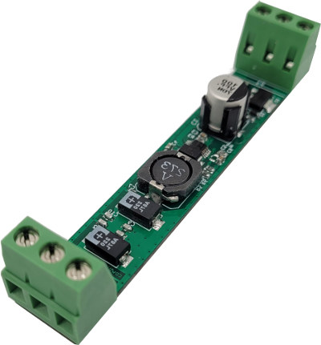
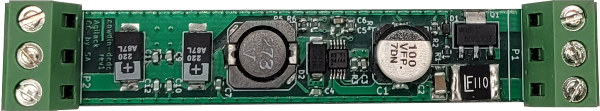
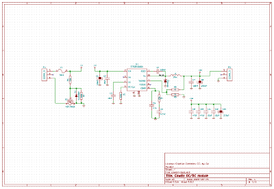
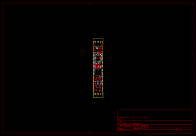

Cowdin DC/DC module
===================

This project is a DC/DC power supply module with a form-factor compatible with
IEC/EN 60715 enclosures (1 unit width). The output voltage is not variable but
it is possible to have different values with this design, by modifying value
of some components.

<table>
<tr><td>
<b>Specifications:</b>
<ul>
  <li>Input voltage:<ul>
    <li>Version 40: 0V -> 36V</li>
    <li>Version 60: 0V -> 48V</li>
  </ul></li>
  <li>Output voltage:<ul>
    <li>Stadard versions : 3,3V / 5V / 12V / 24V</li>
    <li>Custom version: any value from 0V to VIn</li>
  </ul></li>
  <li>Output current : up to 1V</li>
</ul>
</td>
<td>

</td>
</tr>
</table>

Sources
-------

This board has been designed using KiCad EDA (version 5). All sources files
(schematics, routing, ...) are available into the `prj-kicad` folder. You can
re-use this design under terms of the Creative Commons ShareAlike license
(CC BY-SA)

<table>
<tr>
<td></td>
<td></td>
</tr>
<tr>
<td>Fig1: Preview of the KiCad schematics</td>
<td>Fig2: Preview of the KiCad routing</td>
</tr>
</table>

